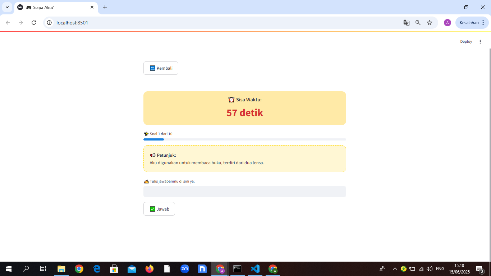
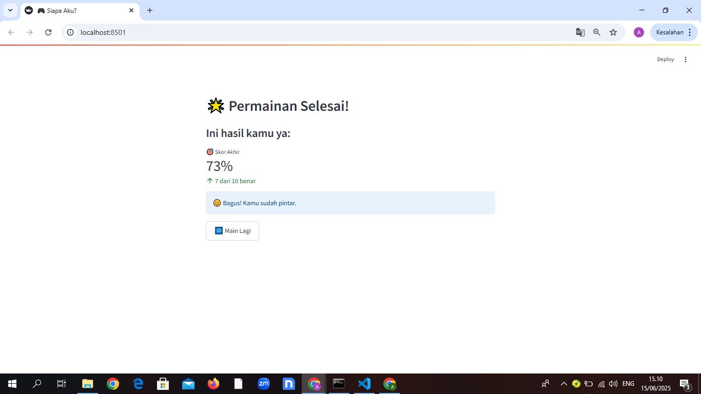

# 🎮 Siapa Aku? - Game Edukasi Berbasis Certainty Factor

**Siapa Aku?** adalah game edukatif interaktif berbasis web yang dirancang untuk melatih kemampuan berpikir analitis dan pemahaman konsep anak-anak. Game ini menggunakan pendekatan *sistem pakar* dengan algoritma **Certainty Factor (CF)** untuk mengevaluasi jawaban pemain.

---

## 🧠 Fitur Utama

- ✅ 10 soal acak dengan deskripsi menantang
- ✅ Penilaian jawaban menggunakan *Certainty Factor*
- ✅ Tampilan visual menarik & ramah anak-anak
- ✅ Feedback skor dan hasil akhir yang memotivasi

---

## 📷 Tampilan Game

| Halaman Beranda | Halaman Soal | Hasil Skor |
|-----------------|--------------|-------------|
|  |  |  |

---

## 🔧 Teknologi yang Digunakan

- [Python 3.9+](https://www.python.org/)
- [Streamlit](https://streamlit.io/) – UI berbasis web
- `utils/cf_engine.py` – Logika *certainty factor*
- HTML/CSS – Styling lucu & cerah

---

## 🚀 Cara Menjalankan

1. **Klon repositori ini**
   ```bash
   git clone https://github.com/AryaForGH/cfgame.git
   cd siapa-aku
   ```

2. **Install dependencies**
   ```bash
   pip install 
   ```

3. **Jalankan aplikasi**
   ```bash
   py -m streamlit run app.py
   ```

4. Akses via browser di `http://localhost:8501`

---

## 📁 Struktur Folder

```
siapa-aku/
├── app.py
├── data/
│   └── soal.json
├── utils/
│   └── cf_engine.py
├── assets/
│   ├── images/
│   │   └── wp-master-1.png
│   │   └── wp-master.png
│   │   └── master1.png
│   │   └── master2.png
│   │   └── master3.png
```

---

## 💡 Tentang Certainty Factor

Game ini menggunakan algoritma **Certainty Factor (CF)** untuk menilai **tingkat kesesuaian jawaban pengguna** terhadap fakta yang diketahui sistem.

> Contoh: Jika jawaban pengguna *"seekor gajah besar"*, dan fakta menyebut *"gajah"*, maka CF bisa 0.8 (80%).

---

## 📌 Contoh Soal (data/soal.json)

```json
{
  "deskripsi": "Aku hewan yang besar, memiliki belalai, dan hidup di darat.",
  "fakta": ["gajah", "belalai", "hewan besar"],
  "cf": [1.0, 0.8, 0.6]
}
```

---

## 📜 Lisensi

MIT License © 2025 [Arya Ramadhan]

---

## 🙌 Kontribusi & Kontak

Game ini dikembangkan untuk tujuan edukatif.  
Ingin berkolaborasi atau punya ide pengembangan?

📧 Email: github.yak@email.com  
📷 IG: @

---